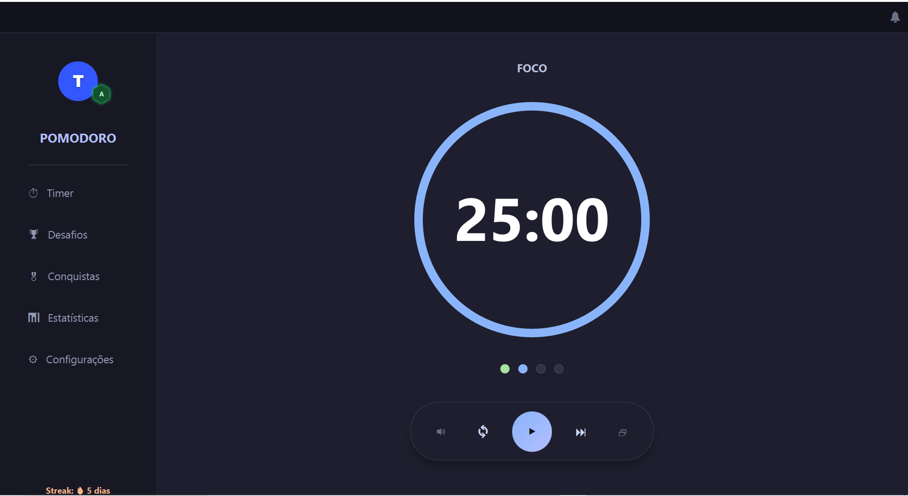
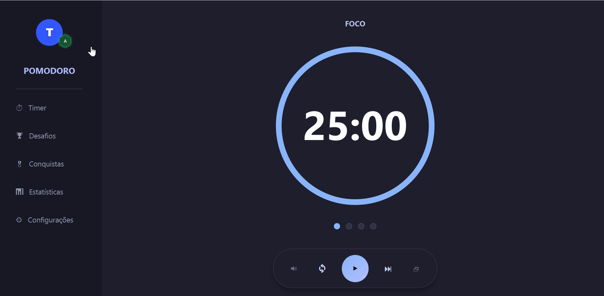
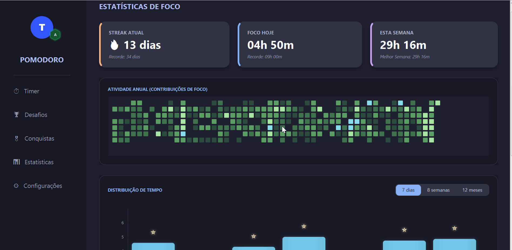
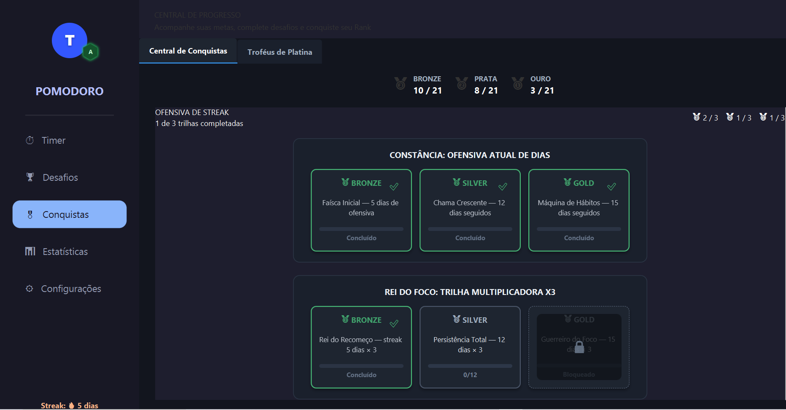
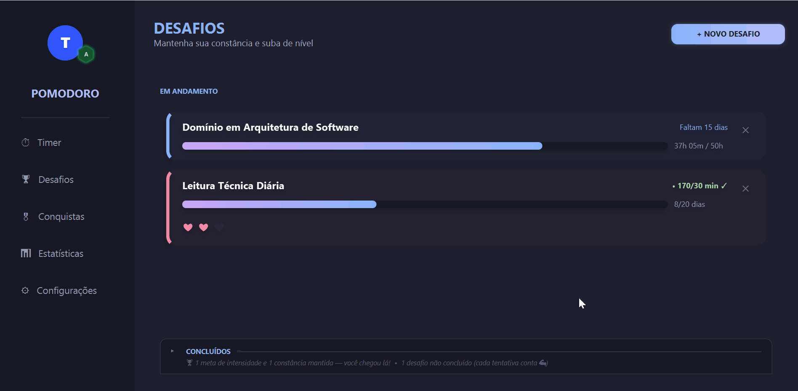
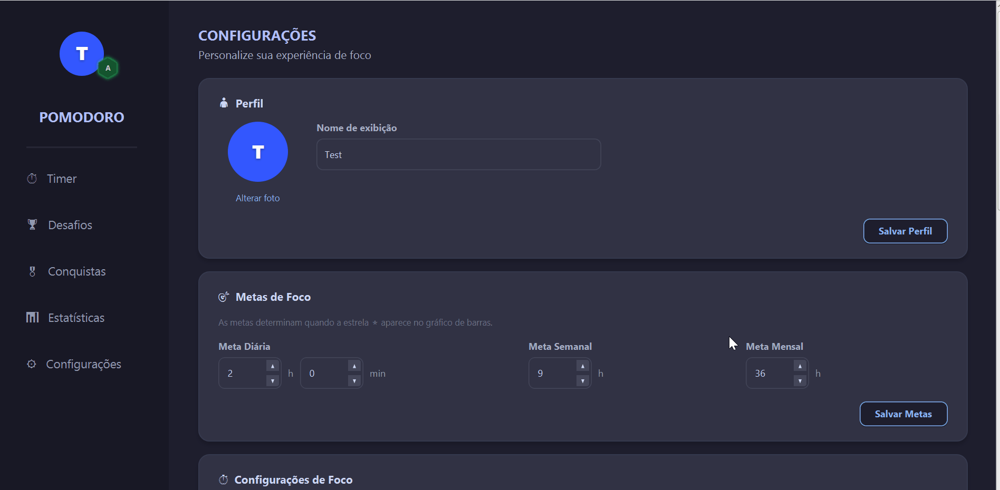

<div align="center">

# 🍅 Pomodoro Focus

### Um app desktop de produtividade que transforma foco em progresso — com streaks, desafios, conquistas e um sistema de ranking que dá vontade de voltar todo dia.

**Java 17 · JavaFX 21 · SQLite · Maven · JUnit 5 · Mockito**

<br/>



</div>

---

## 💡 Sobre o projeto

**Pomodoro Focus** não é só mais um cronômetro Pomodoro. É uma aplicação desktop completa, construída em Java com JavaFX, que aplica princípios de gamificação para transformar uma técnica simples de produtividade em uma experiência engajante: o usuário acompanha estatísticas reais de foco, mantém sequências (*streaks*), cria desafios pessoais de constância e intensidade, desbloqueia conquistas em 4 tiers (Bronze/Prata/Ouro/Platina) e evolui em um sistema de ranking por XP (de **E** até **SS**).

Todo o projeto foi desenhado com **separação de camadas** (domínio, serviço, infraestrutura e UI), **persistência real em SQLite**, e uma suíte de **testes unitários com JUnit 5 + Mockito** cobrindo as regras de negócio mais sensíveis (cálculo de estatísticas, XP, streaks, desafios e conquistas).

> Este projeto nasceu como uma forma de aprofundar conhecimentos em Java, JavaFX e boas práticas de arquitetura de software — e acabou virando uma ferramenta que eu mesmo uso no dia a dia.

<br/>

<div align="center">
  
</div>

---

## ✨ Funcionalidades

### ⏱️ Timer Pomodoro completo
- Ciclos configuráveis de foco, pausa curta e pausa longa (padrão 25/5/15, totalmente customizável).
- Indicadores visuais (*pips*) do progresso dentro do ciclo de 4 sessões.
- Modo **janela flutuante (mini timer)** para acompanhar o cronômetro enquanto trabalha em outro app.
- Feedback sonoro no início/fim das sessões, com controle de volume e mudo.

---

### 📊 Estatísticas de foco
- Heatmap anual estilo GitHub com a intensidade de foco por dia.
- Gráficos de barras com visão diária, semanal (8 semanas) e mensal (ano fixo).
- Linha de meta dinâmica no gráfico + destaque com ⭐ nos dias/semanas/meses que superam a meta.
- Pódios de recordes: **maiores dias de foco**, **melhores meses** e **maiores streaks**.

<br/>

<div align="center">
  
</div>

---

### 🏆 Sistema de Conquistas
- Mais de **60 conquistas** organizadas em trilhas (Bronze → Prata → Ouro → Platina).
- Categorias: Foco Diário, Streaks, Desafios, Meta-conquistas e Ranking.
- Arquitetura extensível via `AchievementEvaluator` — cada categoria tem seu próprio avaliador de regras.
- Meta-conquistas em cascata (ex: "colecione X conquistas de ouro") avaliadas no mesmo ciclo de verificação.

<br/>

<div align="center">
  
</div>

---

### 🎯 Desafios personalizados
- **Desafios de Constância**: manter uma meta diária de foco por N dias, com sistema de "vidas" para tolerar falhas pontuais.
- **Desafios de Intensidade**: acumular um total de horas de foco dentro de um prazo.
- Histórico colapsável de desafios concluídos e falhos, com resumo textual dinâmico.

<br/>

<div align="center">
  
</div>

---

### 🔥 Streaks e Ranking
- Cálculo automático da sequência atual de dias com foco e histórico dos top streaks.
- Sistema de **XP e Ranking** (E → D → C → B → A → S → SS) com badge hexagonal visual.
- Progressão de XP concedida por sessões completas, desafios vencidos e conquistas desbloqueadas.

---

### 🔔 Notificações em tempo real
- Toasts com animação para conquistas, metas batidas, ciclos completos e desafios.
- Central de notificações com histórico e contador de não lidas.
- Proteção anti-spam para notificações de metas recorrentes.

---

### ⚙️ Configurações completas
- Perfil (avatar customizado + nome), metas de foco, durações do timer, áudio, idioma e notificações.
- **Zona de risco** com confirmação por *countdown* de segurança para limpar histórico ou resetar todo o progresso.

<br/>

<div align="center">
  
</div>

---

## 🏗️ Decisões de Arquitetura & Design

- **Strategy Pattern para conquistas**: cada categoria de conquista (Foco, Streak, Desafio, Ranking, Meta-conquistas) possui seu próprio `AchievementEvaluator`, injetado no `AchievementService`. Adicionar uma nova categoria não exige alterar código existente.
- **Listener Pattern no timer**: `PomodoroService` notifica múltiplos `TimerChangeListener` (janela principal + mini timer flutuante) de forma thread-safe, permitindo que ambas as UIs fiquem sincronizadas em tempo real.
- **Fail-Fast no domínio**: entidades como `Profile` e `Challenge` validam seus próprios invariantes nos setters, lançando exceções de domínio específicas (`PomodoroException` e subclasses) em vez de deixar estados inconsistentes se propagarem.
- **Migrations defensivas no SQLite**: `DatabaseInitializer` aplica migrações incrementais (`ALTER TABLE` protegido) para não quebrar bancos de usuários que já tinham uma versão anterior do schema.
- **Persistência granular**: em vez de um `save()` genérico que sobrescreve tudo, o `ProfileRepository` expõe métodos cirúrgicos (`updateGoals`, `updateDurations`, `updateSettings`...) — evitando *race conditions* e updates acidentais de campos não relacionados.
- **Serviços com dependências opcionais**: `NotificationService`, por exemplo, é injetado como dependência *nullable* em vários serviços, mantendo retrocompatibilidade total com os testes já existentes ao evoluir o sistema.

---

## 🛠️ Stack Tecnológica

| Camada | Tecnologia |
|---|---|
| **Linguagem** | Java 17 |
| **UI** | JavaFX 21 (FXML + CSS customizado, tema Catppuccin Mocha) |
| **Persistência** | SQLite (via `sqlite-jdbc`) |
| **Build** | Maven |
| **Testes** | JUnit 5, Mockito, Spring Test (`ReflectionTestUtils`) |
| **Logging** | SLF4J + Logback |
| **Serialização** | Jackson Databind |
| **CI** | GitHub Actions (build automatizado a cada push/PR) |

---

## 🚀 Como executar

### Pré-requisitos
- JDK 17+
- Maven 3.8+

### Passo a passo

```bash
# Clone o repositório
git clone https://github.com/seu-usuario/pomodoro-focus.git
cd pomodoro-focus

# Rode a aplicação
mvn clean javafx:run
```

O banco de dados SQLite (`pomodoro.db`) é criado e migrado automaticamente na primeira execução — nenhuma configuração manual é necessária.

### Rodando os testes

```bash
mvn clean verify
```

A suíte cobre `StatsService`, `AchievementService`, `ChallengeService`, `ProfileService`, `FocusSessionService`, `PomodoroService`, `NotificationService`, `AudioService` e os repositórios SQLite, com foco em regras de negócio, cálculos de estatísticas e integridade de dados.

---

## 🗺️ Roadmap

- [ ] Internacionalização completa da interface (estrutura de idioma já persistida no perfil)
- [ ] Sincronização em nuvem entre dispositivos
- [ ] Exportação de estatísticas (CSV / PDF)
- [ ] Temas visuais adicionais além do Catppuccin Mocha

---

## 📄 Licença

Este projeto está disponível sob a licença MIT — sinta-se à vontade para estudar, adaptar e contribuir.

<div align="center">

Feito com foco por **Thomaz Collet**

</div>
